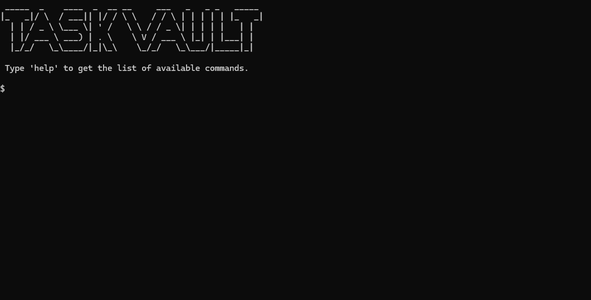

# Task Vault Portable
TaskVault is now integrated in [Curvv](https://github.com/Khalid-Azmatullah/curvv) package.


Task Vault Portable is a multi-tasking tool for operating simple tasks from one window.

To use Task Vault simply download the [TVP.exe](TVP.exe) program and run it.

The following screen will appear:



Now simply run:
```
help
```

This shall provide you with all the available commands.

``` 
COMMAND LIST: 
1. c - Opens Chrome in Guest mode. 
2. q - Searches your query in chrome. 
3. w3c - Opens the C++ Syntax page. 
4. help - Provides list of commands available in TaskVault. 
5. exit - Exits the program.
```

Feel free to explore all these commands and do provide feedback!

Last Updated:
```
05/10/2024
```

Current Version:
```
0.0.2
```

> [!IMPORTANT]
> For Embed Version Read [EmbedRD.md](tsv-embed/README.md)
